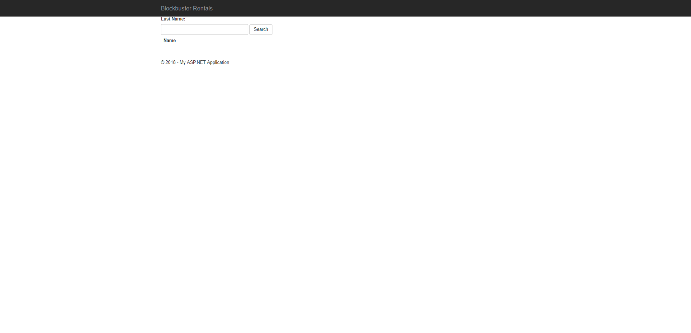
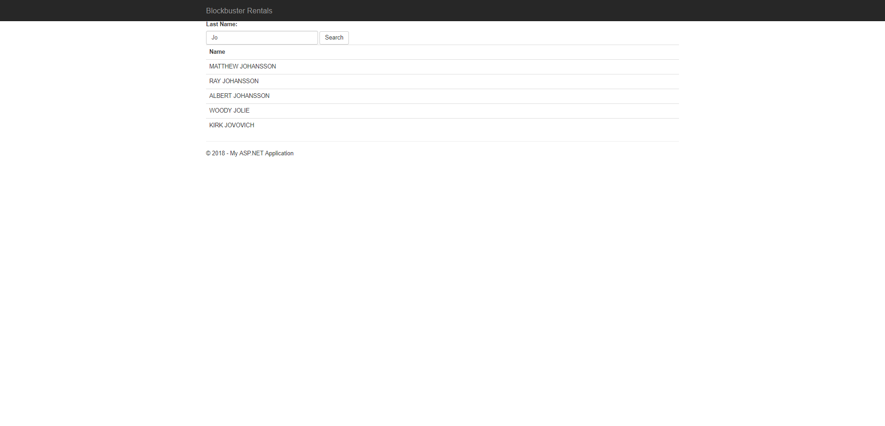
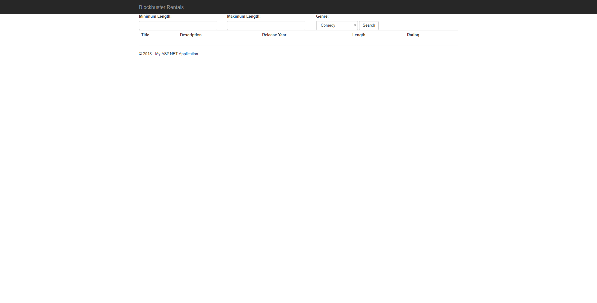
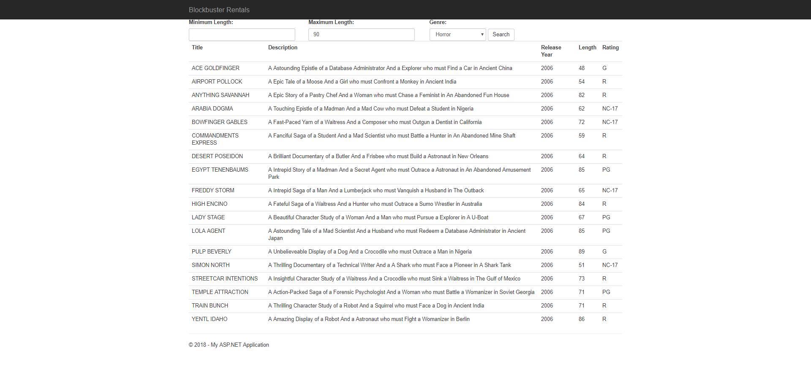
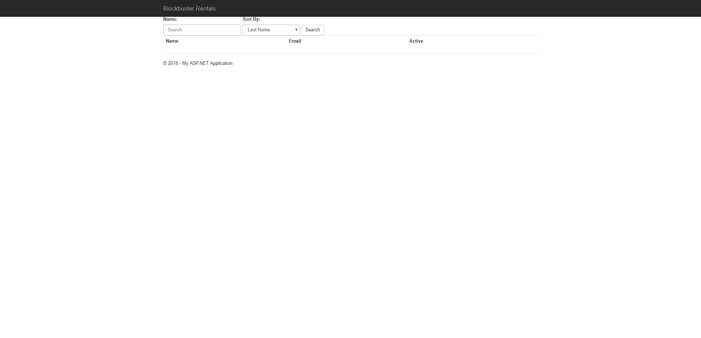
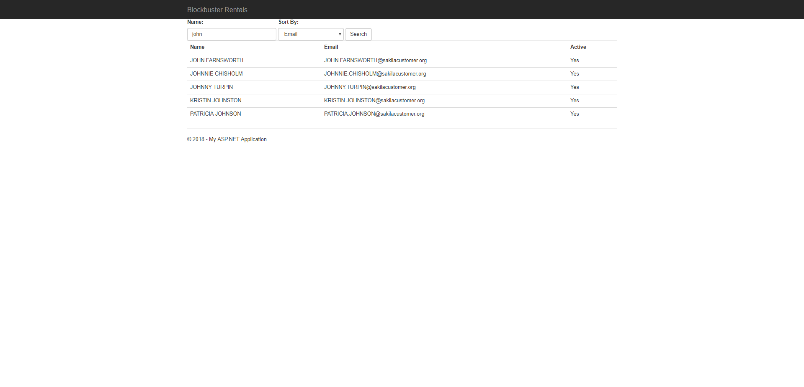

# Exercises

All exercises use the dvdstore database. DALs are already created, except for the Customer Search, where you'll fill in the data access methods.

## Actor Search

Given a search string, display all the actors whose `last_name` contains that search string. The display should show `first_name` and `last_name`, as shown below:

## Film Search

Given a minimum length, maximum length, and genre, display a list of movies that match the search. Minimum and Maximum length could both be blank. The display should show `title`, `description`, `release_year`, `length`, and `rating`.

You can default the maximum length to 1000 if it is left blank.

Look at nullable integers `int?` for how to have an empty int value.

## Customer Search

Given a name search and a sort order, display all customers whose `first_name` or `last_name` match the search in the order specified. The sort order could be by `last_name`, `email`, or `active`. You need to make a DAL for this exercise.

