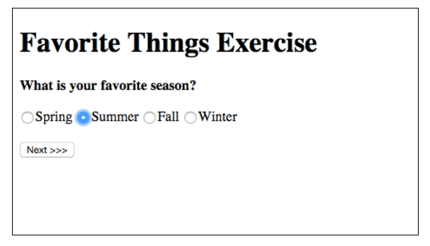

# NOTE: This exercise is **NOT REQUIRED** and *will not be graded*.  I included it here in case you wanted a little more practice at using Asp.NET Session.  

# Favorite Things Survey

In this exercise, your application should ask the user a series of questions and store each answer in the HTTP session.

A controller called `FavoriteThingsController` has already been created for you. This is where you should add information submitted by the user to the session. Additionally, you have been provided the first .cshtml page called `Page1.cshtml` as a starting point.

Sessions have already been configured for you, and the `SessionExtensions` class has also been provided. This allows you to Set objects in the session and Get the objects back out of the session more easily and is based on the code provided by Microsoft in the [ASP.NET MVC session documentation](https://docs.microsoft.com/en-us/aspnet/core/fundamentals/app-state).

After asking the user all of the questions, you'll display the answers they provided on a summary page.

## Page 1

The user sees the first page at **FavoriteThings/Page1**.

## Page 2

The user sees the second page at **FavoriteThings/Page2**.

## Page 3

The user sees the third page at **FavoriteThings/Page3**.

## Confirm

The user sees the last page at **FavoriteThings/Summary**.

# Hints

* You'll need to create a FavoriteThings model that holds the answers to all of the possible questions that the user fills out.

* You'll need to use Session to store the in-progress status of the favorite things survey.

* Remember to use the [Post-Redirect-Get (PRG) pattern][post-redirect-get pattern] to navigate from one page to another.

[ASP.NET session documentation]: https://docs.microsoft.com/en-us/aspnet/core/fundamentals/app-state?view=aspnetcore-2.1#session-state
[post-redirect-get pattern]: https://en.wikipedia.org/wiki/Post/Redirect/Get